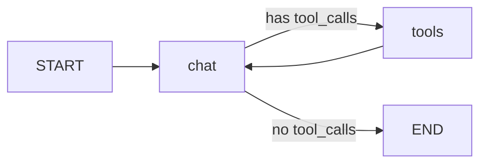

# Topic 3: Agent Tool Use

## Table of Contents

1. [Task 1: Ollama and MMLU timing](#task-1)
2. [Task 2: OpenAI GPT-4o Mini](#task-2)
3. [Task 3: Manual tool handling (calculator)](#task-3)
4. [Task 4: LangGraph tools (calculator, letter count, word count)](#task-4)
5. [Task 5: Conversation with checkpointing](#task-5)
6. [Parallelization opportunity](#parallelization)

## Setup

- **Ollama:** Install Ollama, run `ollama pull llama3.2:1b`. Use `task1_ollama_single_topic.py` for single-topic MMLU.
- **OpenAI:** Set `OPENAI_API_KEY` in environment (never commit the key). For Colab, use Secrets and `os.environ["OPENAI_API_KEY"] = userdata.get('OPENAI_API_KEY')`.

## Task 1: Ollama and MMLU timing

- **task1_mmlu_single_topic.py** – Hugging Face model, one MMLU subject. Usage: `python task1_mmlu_single_topic.py --topic astronomy`
- **task1_ollama_single_topic.py** – Same via Ollama. Usage: `python task1_ollama_single_topic.py --topic astronomy`
- **run_sequential_parallel.sh** / **run_sequential_parallel.bat** – Time sequential vs parallel runs of two topics.

**Observation:** Sequential run time ≈ sum of the two jobs; parallel run time ≈ max of the two when two processes run concurrently, so total wall-clock time is lower for parallel.

## Task 2: OpenAI GPT-4o Mini

- **task2_openai_gpt4o_mini_test.py** – Verifies API key and model.

**Explanation:**

- `client = OpenAI()` – Creates a client that uses `os.getenv("OPENAI_API_KEY")` by default for authentication.
- `response = client.chat.completions.create(...)` – Sends an HTTP request to the OpenAI API; `messages` is the conversation, `model` selects the model, `max_tokens` limits the response length.

## Task 3: Manual tool handling (calculator)

- **task3_manual_tool_calculator.py** – Calculator tool with geometric functions (sin, cos, tan, sqrt, etc.). Uses `json.loads` for input and `json.dumps` for output; evaluation uses a restricted namespace with `math` functions.

## Task 4: LangGraph tools

- **task4_langgraph_tools.py** – Defines three tools: calculator (with geometric functions), `count_letter` (e.g. “How many s in Mississippi riverboats?”), and `word_count`. Uses a `tool_map`-style dispatch: `TOOL_MAP = {t.name: t for t in TOOLS}` and invokes via `create_react_agent`. Supports multi-tool and chaining (e.g. letter count twice then calculator).

## Task 5: Conversation with checkpointing

- **task5_conversation_checkpointing.py** – Single long conversation using LangGraph nodes/edges and `MemorySaver` for checkpointing. Restart with the same `thread_id` to resume.

**Mermaid diagram of the system:**

## Parallelization opportunity

**Where could we add parallelization?**

- **Tool execution:** When the model returns multiple `tool_calls` in one turn, those tools can be executed in parallel (e.g. two letter counts and one calculator) instead of one after the other. LangGraph’s `ToolNode` can run multiple tool invocations in parallel when the state contains several tool calls. In a custom loop, we would dispatch each tool call to a thread or async task and then gather results before appending tool messages and continuing.

---

## Terminal output (logs)

Saved outputs from running the programs:
- `log_task2_openai_test.txt` – OpenAI GPT-4o Mini verification
- `log_task3_manual_calculator.txt` – Manual calculator with tool use
- `log_task4_langgraph_tools.txt` – LangGraph tools (e.g. letter count)
- `log_task5_checkpointing.txt` – Conversation with checkpointing

From repo root: `py -3 run_all_logs.py --topic 3`

## File index

| File | Purpose |
|------|--------|
| task1_mmlu_single_topic.py | Single-topic MMLU (Hugging Face) |
| task1_ollama_single_topic.py | Single-topic MMLU (Ollama) |
| task2_openai_gpt4o_mini_test.py | GPT-4o Mini API test |
| task3_manual_tool_calculator.py | Manual calculator tool (geometric) |
| task4_langgraph_tools.py | LangGraph calculator, count_letter, word_count |
| task5_conversation_checkpointing.py | Conversation + checkpointing |
| run_sequential_parallel.bat / .sh | Timing: sequential vs parallel |
